# 开发笔记


# 登录注册实现

需求, 用户登录注册并且有日志记录

## 技术选型

常用的登录 session. 分布式session(redis).  JWT.

单体项目没必要redis.

session 和 JWT. session吧.


## 具体实现

库表设计

```sql
create  database  supstar;

use supstar;
-- 用户表
create table if not exists user
(
    id           bigint auto_increment comment 'id' primary key,
    userAccount  varchar(256)                           not null comment '账号',
    userPassword varchar(512)                           not null comment '密码',
    userName     varchar(256)                           null comment '用户昵称',
    userAvatar   varchar(1024)                          null comment '用户头像',
    userRole     varchar(256) default 'user'            not null comment '用户角色：user/admin',
    createTime   datetime     default CURRENT_TIMESTAMP not null comment '创建时间',
    updateTime   datetime     default CURRENT_TIMESTAMP not null on update CURRENT_TIMESTAMP comment '更新时间',
    isDelete     tinyint      default 0                 not null comment '是否删除',
    index idx_userAccount (userAccount)
) comment '用户' collate = utf8mb4_unicode_ci;

```

引入依赖

web, aop , mysql, mybatis,mybatis-plus, knife4j,lombok,springtest,hutool,common

```xml
 <dependencies>

        <dependency>
            <groupId>org.springframework.boot</groupId>
            <artifactId>spring-boot-starter-web</artifactId>
        </dependency>

        <dependency>
            <groupId>org.springframework.boot</groupId>
            <artifactId>spring-boot-starter-aop</artifactId>
        </dependency>

        <dependency>
            <groupId>mysql</groupId>
            <artifactId>mysql-connector-java</artifactId>
            <scope>runtime</scope>
        </dependency>


        <dependency>
            <groupId>org.mybatis.spring.boot</groupId>
            <artifactId>mybatis-spring-boot-starter</artifactId>
            <version>2.2.2</version>
        </dependency>


        <!-- https://mvnrepository.com/artifact/com.baomidou/mybatis-plus-boot-starter -->
        <dependency>
            <groupId>com.baomidou</groupId>
            <artifactId>mybatis-plus-boot-starter</artifactId>
            <version>3.5.2</version>
        </dependency>


        <!-- https://doc.xiaominfo.com/docs/quick-start#openapi2 -->
        <dependency>
            <groupId>com.github.xiaoymin</groupId>
            <artifactId>knife4j-openapi2-spring-boot-starter</artifactId>
            <version>4.4.0</version>
        </dependency>

        <!-- https://mvnrepository.com/artifact/org.apache.commons/commons-lang3 -->
        <dependency>
            <groupId>org.apache.commons</groupId>
            <artifactId>commons-lang3</artifactId>
        </dependency>


        <!-- https://hutool.cn/docs/index.html#/-->
        <dependency>
            <groupId>cn.hutool</groupId>
            <artifactId>hutool-all</artifactId>
            <version>5.8.8</version>
        </dependency>


        <dependency>
            <groupId>org.springframework.boot</groupId>
            <artifactId>spring-boot-configuration-processor</artifactId>
            <optional>true</optional>
        </dependency>
        <dependency>
            <groupId>org.projectlombok</groupId>
            <artifactId>lombok</artifactId>
            <optional>true</optional>
        </dependency>
        <dependency>
            <groupId>org.springframework.boot</groupId>
            <artifactId>spring-boot-starter-test</artifactId>
            <scope>test</scope>
        </dependency>
    </dependencies>
```

1） 注册

参数 username. password,checkpassword.

```java
    /**
     * 用户注册
     * @param userAccount
     * @param userPassword
     * @param checkPassword
     * @return
     */
    @Override
    public long register(String userAccount, String userPassword, String checkPassword) {
        // 逻辑校验
        if (StringUtils.isAnyBlank(userAccount, userPassword, checkPassword)) {
            throw new BusinessException(ErrorCode.PARAMS_ERROR, "参数为空");
        }

        // 业务校验
        if (userAccount.length() < 4) {
            throw new BusinessException(ErrorCode.PARAMS_ERROR, "用户账号过短");
        }
        if (userPassword.length() < 8 || checkPassword.length() < 8) {
            throw new BusinessException(ErrorCode.PARAMS_ERROR, "用户密码过短");
        }
        // 密码和校验密码相同
        if (!userPassword.equals(checkPassword)) {
            throw new BusinessException(ErrorCode.PARAMS_ERROR, "两次输入的密码不一致");
        }

        synchronized (userAccount.intern()) {
            // 账户不能重复
            LambdaQueryWrapper<User> userLambdaQueryWrapper = new LambdaQueryWrapper<>();
            userLambdaQueryWrapper.eq(User::getUserAccount, userAccount);
            long count = this.baseMapper.selectCount(userLambdaQueryWrapper);
            if (count > 0) {
                throw new BusinessException(ErrorCode.PARAMS_ERROR, "账号重复");
            }
            // 2. 加密
            String encryptPassword = DigestUtils.md5DigestAsHex((SALT + userPassword).getBytes());
            // 3. 插入数据
            User user = new User();
            user.setUserAccount(userAccount);
            user.setUserPassword(encryptPassword);
            user.setUserName(userAccount);


            boolean saveResult = this.save(user);
            if (!saveResult) {
                throw new BusinessException(ErrorCode.SYSTEM_ERROR, "注册失败，数据库错误");
            }
            return user.getId();
        }
    }
```

2）登录

15min

```java
   /**
     * 用户登录
     * @param userAccount
     * @param userPassword
     * @return
     */
    @Override
    public LoginUserVo login(String userAccount, String userPassword, HttpServletRequest request) {
        //参数逻辑校验
        if (StringUtils.isAnyBlank(userAccount, userPassword)) {
            throw new BusinessException(ErrorCode.PARAMS_ERROR, "参数为空");
        }

        // 业务逻辑校验  能避免不符合的数据直接请求数据库
        if (userAccount.length() < 4) {
            throw new BusinessException(ErrorCode.PARAMS_ERROR, "账号错误");
        }
        if (userPassword.length() < 8) {
            throw new BusinessException(ErrorCode.PARAMS_ERROR, "密码错误");
        }

        // 账户是否存在
        LambdaQueryWrapper<User> userLambdaQueryWrapper = new LambdaQueryWrapper<>();
        userLambdaQueryWrapper.eq(User::getUserAccount, userAccount);
        User user = this.getOne(userLambdaQueryWrapper);
        if (user == null) {
            throw new BusinessException(ErrorCode.PARAMS_ERROR, "用户不存在");
        }
        // 密码是否正确
        String encryptPassword = DigestUtils.md5DigestAsHex((SALT + userPassword).getBytes());
        if (!Objects.equals(user.getUserPassword(), encryptPassword)) {
            throw new BusinessException(ErrorCode.PARAMS_ERROR, "密码错误");
        }

        // 返回结果 不返回敏感信息，比如说密码
        LoginUserVo loginUserVo = new LoginUserVo();
        BeanUtils.copyProperties(user, loginUserVo);


        //存在将用户信息存在session中
        request.getSession().setAttribute("user",loginUserVo);
        return loginUserVo;
    }
```

ok, 登录

对身份进行验证。 session。

编写拦截器

```java
/**
 * 拦截器，拦截需要认证的业务
 */
public class LoginInterceptor implements HandlerInterceptor {


    @Override
    public boolean preHandle(HttpServletRequest request, HttpServletResponse response, Object handler) throws Exception {

        //  session登录方式
//        //1. 获取session
        HttpSession session = request.getSession();
//        // 2. 获取session中的用户
        Object user = session.getAttribute("user");
        if (user == null ) {
            //没有用户信息
            response.setStatus(401);
            response.setContentType("application/json");
            response.setCharacterEncoding("UTF-8");
            response.getWriter().write("{\"code\": 401, \"message\": \"用户未登录\"}");
            return false;
        }

//        //3. todo 保存到ThreadLocal中
//        UserHolder.saveUser((User) user);

        return true;

    }

    // todo ThreadLocal
//    @Override
//    public void afterCompletion(HttpServletRequest request, HttpServletResponse response, Object handler, Exception ex) throws Exception {
//       //移除信息，避免内存泄露
//        UserHolder.removeUser();
//    }
}
```

配置拦截器

```java
/**
 * webMvc 配置
 */
@Configuration
public class WebMvcConfig implements WebMvcConfigurer {

    /**
     * 添加拦截器
     * @param registry
     */
    @Override
    public void addInterceptors(InterceptorRegistry registry) {

        registry.addInterceptor(new LoginInterceptor())
                .excludePathPatterns(
                        "/doc.html",
                        "/webjars/**",
                        "/swagger-resources",
                        "/swagger-resources/**",
                        "/v3/**",
                        "/favicon.ico",
                        "Mozilla/**",
            
                        "/user/register",
                        "/user/login");

    }
}
```


其中 是排除knif4j 

```java
 .excludePathPatterns(
                        "/doc.html",
                        "/webjars/**",
                        "/swagger-resources",
                        "/swagger-resources/**",
                        "/v3/**",
                        "/favicon.ico",
                        "Mozilla/**",)
     
```


# 日志的实现

## 技术选型

Spring Boot 内置 **Logback** 作为默认日志框架，并且支持 **SLF4J** 。

ELK 之后考虑。

## 实现

在每个请求来临都进行拦截，记录日志，比如 ip,请求地址，请求参数，以及响应信息。

可以使用拦截器，或者AOP。

[过滤器、拦截器和AOP的分析与对比 - 🐫沙漠骆驼 - 博客园](https://www.cnblogs.com/goSilver/p/11773972.html)

总的来说，过滤器，是所有的请求，在请求到达服务之前，通过过滤的请求才能访问我们的controller(比如说，在过滤器过滤黑名单)。

springWeb提供的拦截器，是拦截所有的到达controller层的代码，在执行controller层代码前后，进行增强(比如说权限校验。)

AOP 的是动态代理，也就是实现了接口的方法，进行增强。可以实现service层的拦截。

Springweb拦截器和AOP 的选择？

Springweb拦截器，拦截controller层代码，可以直接使用url,request等更方便使用controller API，　权限校验（用户的登录状态）建议在拦截器中执行。

AOP 比拦截器更灵活，日志完全可以使用AOP，比拦截器好，或者使用拦截器记录controller，aop记录service.


本次使用AOP来进行权限实现。

```java
**
 * 日志 AOP
 */
@Component
@Aspect
@Slf4j
public class LogInterceptor {


    @Around("execution(* com.ls.supstar.controller.*.*(..))")
    public Object doInterceptor(ProceedingJoinPoint point) throws Throwable {

        // 记时
        StopWatch stopWatch = new StopWatch();
        stopWatch.start();

        // 获取请求的路径
        RequestAttributes requestAttributes = RequestContextHolder.currentRequestAttributes();
        HttpServletRequest request = ((ServletRequestAttributes) requestAttributes).getRequest();

        // 生成请求日志唯一id
        String requestId = UUID.randomUUID().toString();

        // 请求的ip
        String requestIp = request.getRemoteAddr();


        // 发起请求的用户
        Object user = request.getSession().getAttribute("user");

        // 请求url
        String url = request.getRequestURL().toString();


        // 请求参数
        Object[] args = point.getArgs();

        String reqParam = "[" + StringUtils.join(args, ",") + "]";

        // 输出请求日志
        log.info("request start: requestId:{}, userId:{},requestIp:{},url:{}, reqParam:{}", requestId,user,requestIp, url, reqParam);

//        // 执行原方法
//        Object result = point.proceed();
//
//        String respParam = result != null ? result.toString() : "null";
//        // 获取相应是否成功
//        // 获取响应结果
//        // 输出响应日志
//        stopWatch.stop();
//        long totalTimeMillis = stopWatch.getTotalTimeMillis();
//        log.info("request end:, requestId: {}, cost: {}ms", requestId, totalTimeMillis);


            // 执行目标方法并获取响应结果
            Object result = point.proceed();

            // 将响应结果转换为字符串
            String respParam = result != null ? result.toString() : "null";

            // 输出响应日志
            stopWatch.stop();
            long totalTimeMillis = stopWatch.getTotalTimeMillis();
            log.info("request end: requestId: {}, cost: {}ms, respParam: {}", requestId, totalTimeMillis, respParam);


        return result;

    }


}
```

默认是在控制台输出，修改配置文件指定日志文件的存储

```yaml
# 日志
logging:
  file:
    name: app.logs
    path: logs

```

上述对于正常的请求（正常执行完毕可以记录下来，对于异常就不行了，我们需要在全局异常处理器那里记录日志）。

我们可以这样，所有的日志信息都在aop中记录，包括异常，然后抛出，在全局异常再次输出详细的报错信息

修改如下

aop 日志

```java
package com.ls.supstar.aop;


import com.ls.supstar.exeception.BusinessException;
import lombok.extern.slf4j.Slf4j;
import org.apache.commons.lang3.StringUtils;
import org.aspectj.lang.ProceedingJoinPoint;
import org.aspectj.lang.annotation.Around;
import org.aspectj.lang.annotation.Aspect;
import org.springframework.stereotype.Component;
import org.springframework.util.StopWatch;
import org.springframework.web.context.request.RequestAttributes;
import org.springframework.web.context.request.RequestContextHolder;
import org.springframework.web.context.request.ServletRequestAttributes;

import javax.servlet.http.HttpServletRequest;
import java.net.InetAddress;
import java.net.UnknownHostException;
import java.util.Random;
import java.util.UUID;

/**
 * 日志 AOP
 */
@Component
@Aspect
@Slf4j
public class LogInterceptor {


    @Around("execution(* com.ls.supstar.controller.*.*(..))")
    public Object doInterceptor(ProceedingJoinPoint point) throws Throwable {

        // 记时
        StopWatch stopWatch = new StopWatch();
        stopWatch.start();

        // 获取请求的路径
        RequestAttributes requestAttributes = RequestContextHolder.currentRequestAttributes();
        HttpServletRequest request = ((ServletRequestAttributes) requestAttributes).getRequest();

        // 生成请求日志唯一id
        String requestId = UUID.randomUUID().toString();

        // 请求的ip
        String requestIp = request.getRemoteAddr();

//        // 请求的主机名称
//        String clientHostName = getClientHostName(requestIp);


        // 发起请求的用户
        Object user = request.getSession().getAttribute("user");

        // 请求url
        String url = request.getRequestURL().toString();


        // todo 请求参数, 注意隐私，特别是密码要进行加密
//        Object[] args = point.getArgs();
//
//        String reqParam = "[" + StringUtils.join(args, ",") + "]";

        // 输出请求日志
//        log.info("request start: requestId:{}, userId:{},requestIp:{},url:{}, reqParam:{}", requestId,user,requestIp, url, reqParam);
        log.info("request start: requestId:{}, userId:{},requestIp:{},url:{}", requestId,user,requestIp, url);


        Object result = null;
        try {

            // 执行目标方法并获取响应结果
            result = point.proceed();

            // 将响应结果转换为字符串
            String respParam = result != null ? result.toString() : "error";

            // 输出响应日志
            stopWatch.stop();
            long totalTimeMillis = stopWatch.getTotalTimeMillis();
            log.info("request end: requestId: {}, cost: {}ms, respParam: {}", requestId, totalTimeMillis, respParam);
        } catch (BusinessException e) {
            stopWatch.stop();
            long totalTimeMillis = stopWatch.getTotalTimeMillis();
            log.error("Business exception caught: requestId: {}, cost: {}ms, code: {}, message: {}",
                    requestId, totalTimeMillis, e.getCode(), e.getMessage());
            throw e; // 保持 BusinessException 类型不变
        } catch (Exception e) {
            stopWatch.stop();
            long totalTimeMillis = stopWatch.getTotalTimeMillis();
            log.error("System exception caught: requestId: {}, cost: {}ms, message: {}",
                    requestId, totalTimeMillis, e.getMessage());
            throw e; // 保持 Exception 类型不变
        }
        return result;

    }


    /**
     * 获取客户端主机名 fv
     * @param clientIp
     * @return
     */
    public static String getClientHostName(String clientIp) {
        try {
            InetAddress inetAddress = InetAddress.getByName(clientIp);
            return inetAddress.getHostName();
        } catch (UnknownHostException e) {
            return "unknown";
        }
    }

}

```

tips: 注意捕获的异常。不要统统捕获Ｅｘｅｃｐｔｉｏｎ异常，保持捕获和抛出的异常一致，这样才能呗全局异常处理器处理特定的异常。

对于全局异常处理器，补充特定的异常，然后输出异常的详细信息

```java
@RestControllerAdvice
@Slf4j
public class GlobalExceptionHandler {
    @ExceptionHandler(BusinessException.class)
    public BaseResponse<?> businessExceptionHandler(BusinessException e) {
        log.error("BusinessException", e);
        return ResultUtils.error(e.getCode(), e.getMessage());
    }

    @ExceptionHandler(RuntimeException.class)
    public BaseResponse<?> runtimeExceptionHandler(RuntimeException e) {
        log.error("RuntimeException", e);
        return ResultUtils.error(ErrorCode.SYSTEM_ERROR, "系统错误");
    }
}
```


## 总结

日志的实现，其实使用Spring拦截器，或者AOP没有太大的区别。只不过AOP能灵活，比如说捕获Service层的信息。

日志具体的实现细节，写一个切面类，实现一个aroud方法（定义切点）记录请求前，执行后的响应，其实没什么好说的，就是要考虑发生异常的情况，发生异常日志怎么记录，是直接在异常那里写日志，还是在AOP中写日志。直接在异常那里写日志，就会导致日志记录信息不全（只能记录请求前，请求后记录不了，因为在此期间发生异常，程序会中断，就记录不下来，但是可以在发生异常那里写日志（但仅仅是打印出异常的信息，向请求url,地址啥的记录不下来，虽然在请求前记录下来了，日志不成对不好观测））。

最佳实践就是，在切面中也捕获异常取记录异常的信息（codo ,msg），然后抛出来，在全局异常处理器记录更详细的信息.


# Druid 监控

引入依赖

```xml
       <!--        https://github.com/alibaba/druid/wiki-->
        <dependency>
            <groupId>com.alibaba</groupId>
            <artifactId>druid-spring-boot-starter</artifactId>
            <version>1.2.22</version>
        </dependency>
```


tips: spring boot 2.7 默认使用Hc

需要排除

```xml
        <dependency>
            <groupId>org.mybatis.spring.boot</groupId>
            <artifactId>mybatis-spring-boot-starter</artifactId>
            <version>2.2.2</version>
            <exclusions>
                <exclusion>
                    <groupId>com.zaxxer</groupId>
                    <artifactId>HikariCP</artifactId>
                </exclusion>
            </exclusions>
        </dependency>
```


配置

```yaml
   type: com.alibaba.druid.pool.DruidDataSource
   # Druid 配置
    druid:
      # 配置初始化大小、最小、最大
      initial-size: 20
      minIdle: 20
      max-active: 20
      # 配置获取连接等待超时的时间(单位：毫秒)
      max-wait: 60000
      # 配置间隔多久才进行一次检测，检测需要关闭的空闲连接，单位是毫秒
      time-between-eviction-runs-millis: 2000
      # 配置一个连接在池中最小生存的时间，单位是毫秒
      min-evictable-idle-time-millis: 600000
      max-evictable-idle-time-millis: 900000
      # 用来测试连接是否可用的SQL语句,默认值每种数据库都不相同,这是mysql
      validationQuery: select 1
      # 应用向连接池申请连接，并且testOnBorrow为false时，连接池将会判断连接是否处于空闲状态，如果是，则验证这条连接是否可用
      testWhileIdle: true
      # 如果为true，默认是false，应用向连接池申请连接时，连接池会判断这条连接是否是可用的
      testOnBorrow: false
      # 如果为true（默认false），当应用使用完连接，连接池回收连接的时候会判断该连接是否还可用
      testOnReturn: false
      # 是否缓存preparedStatement，也就是PSCache。PSCache对支持游标的数据库性能提升巨大，比如说oracle
      poolPreparedStatements: true
      # 要启用PSCache，必须配置大于0，当大于0时， poolPreparedStatements自动触发修改为true，
      # 在Druid中，不会存在Oracle下PSCache占用内存过多的问题，
      # 可以把这个数值配置大一些，比如说100
      maxOpenPreparedStatements: 20
      # 连接池中的minIdle数量以内的连接，空闲时间超过minEvictableIdleTimeMillis，则会执行keepAlive操作
      keepAlive: true
      # Spring 监控，利用aop 对指定接口的执行时间，jdbc数进行记录
      aop-patterns: "com.springboot.template.dao.*"
      ########### 启用内置过滤器（第一个 stat 必须，否则监控不到SQL）##########
      filters: stat,wall,log4j2
      # 自己配置监控统计拦截的filter
      filter:
        # 开启druiddatasource的状态监控
        stat:
          enabled: true
          db-type: mysql
          # 开启慢sql监控，超过2s 就认为是慢sql，记录到日志中
          log-slow-sql: true
          slow-sql-millis: 2000
        # 日志监控，使用slf4j 进行日志输出
        slf4j:
          enabled: true
          statement-log-error-enabled: true
          statement-create-after-log-enabled: false
          statement-close-after-log-enabled: false
          result-set-open-after-log-enabled: false
          result-set-close-after-log-enabled: false
      ########## 配置WebStatFilter，用于采集web关联监控的数据 ##########
      web-stat-filter:
        enabled: true                   # 启动 StatFilter
        url-pattern: /* # 过滤所有url
        exclusions: "*.js,*.gif,*.jpg,*.png,*.css,*.ico,/druid/*" # 排除一些不必要的url
        session-stat-enable: true       # 开启session统计功能
        session-stat-max-count: 1000 # session的最大个数,默认100
      ########## 配置StatViewServlet（监控页面），用于展示Druid的统计信息 ##########
      stat-view-servlet:
        enabled: true                   # 启用StatViewServlet
        url-pattern: /druid/* # 访问内置监控页面的路径，内置监控页面的首页是/druid/index.html
        reset-enable: false              # 不允许清空统计数据,重新计算
        login-username: root # 配置监控页面访问密码
        login-password: 123
        allow: 127.0.0.1 # 允许访问的地址，如果allow没有配置或者为空，则允许所有访问
        deny: # 拒绝访问的地址，deny优先于allow，如果在deny列表中，就算在allow列表中，也会被拒绝
```

tips: 配置了拦截器，所以要排除对druid 的拦截.


# 前端登录注册

技术选型 vue ,React 


## 前端项目初始化

[文档总览 - Ant Design Pro](https://pro.ant.design/zh-CN/docs/overview)

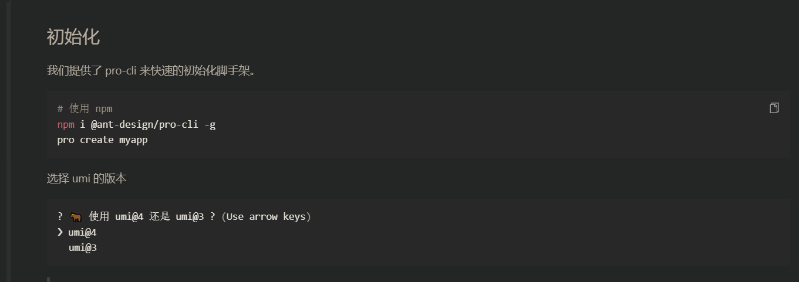

下载依赖 npm install i

启动测试: 可以以mock 方式启动，会有一些假数据

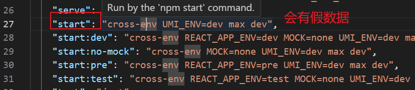

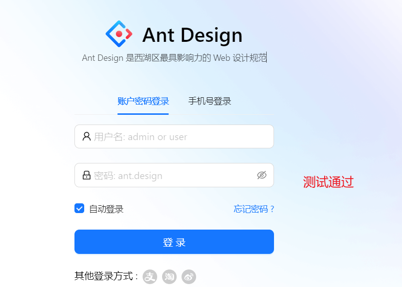

删除没用的元素，比如说国际化，还有其他一些东西。

删除前端测试和mock

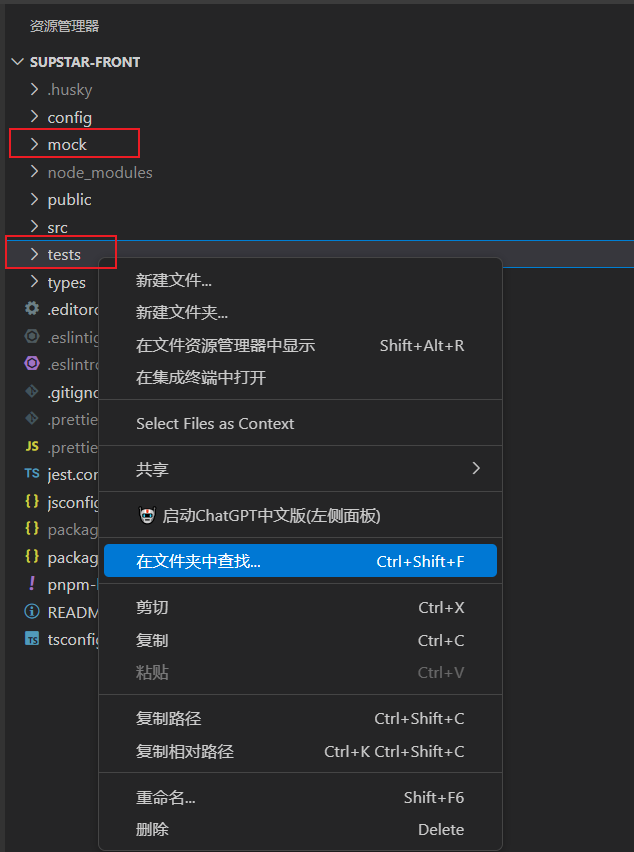

tips: 删除一下，记录测试一下，别启动不了了

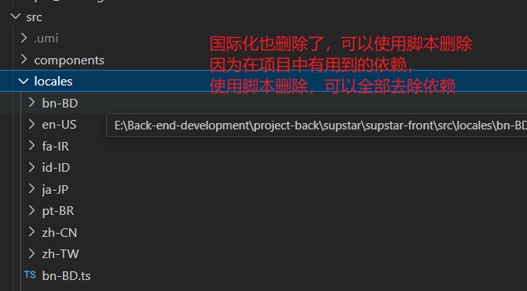

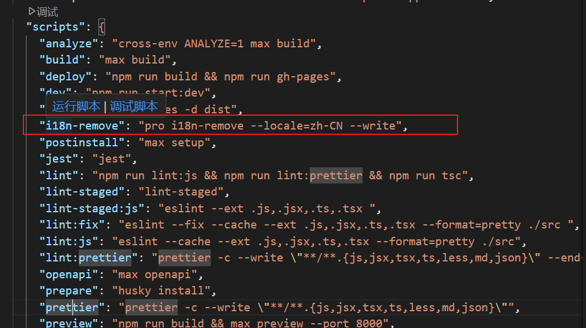

报错 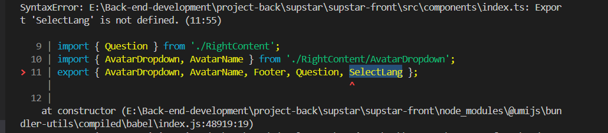

删除就行 ok

最后手动删除locales 文件。

FK: 应该最后再删除MOck 元素的。记得在移除国际化之后也会会有bug，我这次没测，大意了。

补充移除的部分

没移除干净元素

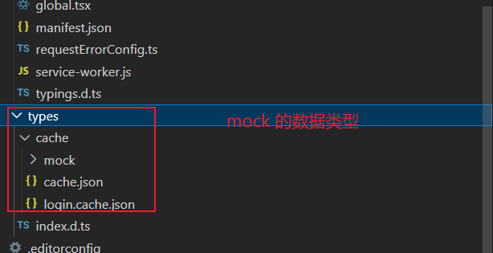

tips: 时刻提醒自己删除东西后都在测试一下，是否有错误。


更换ico,更换titile

替换logo： [iconfont-阿里巴巴矢量图标库](https://www.iconfont.cn/search/index)


## 登录页面

具体逻辑就是点击登录，发送axios 请求，并且接收到响应结果。

现在首先就是写axios请求。我们项目中使用了openapi,就可以根据接口文档生成请求的axios.

配置openapi，指向我们的接口文档json数据（不是接口文档地址）

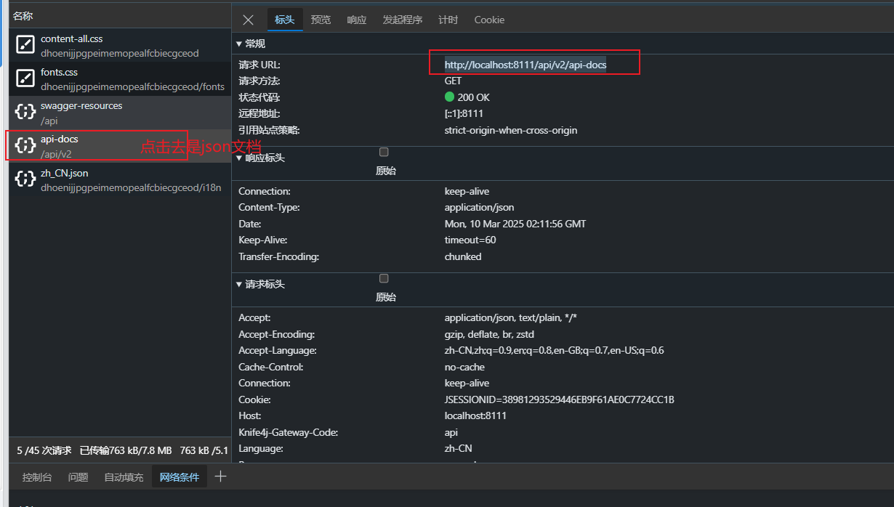

在config下config.ts，配置openapi请求地址。

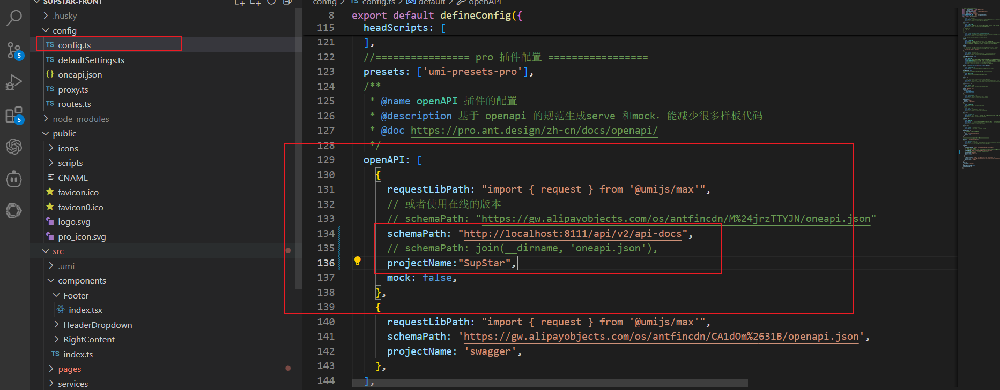

启动 opneapi 脚本

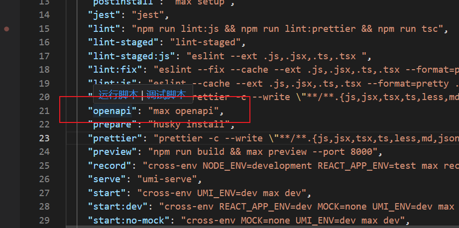

成功显示

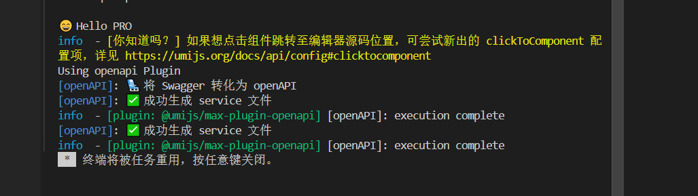

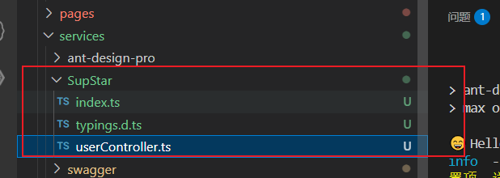

直接取登录测试，

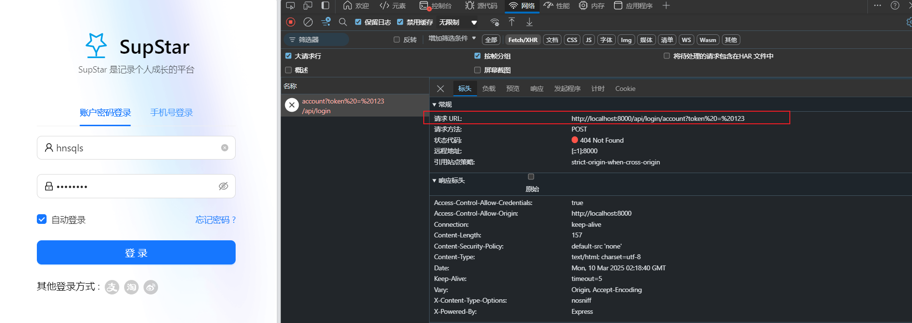

请求的url,不是我们的后端地址，那就修改通用请求类。

我们要修改request 的请求路径

src 下 app.tsx


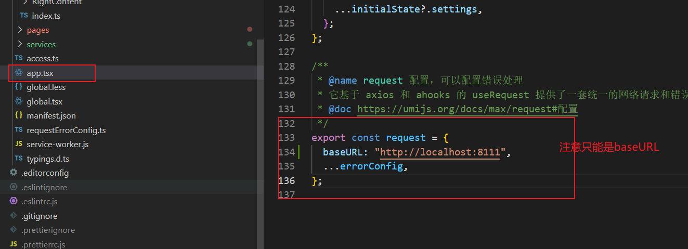

为什么还是8000


没怎么变化，自己又好了，我只删了一个无关紧要的元素

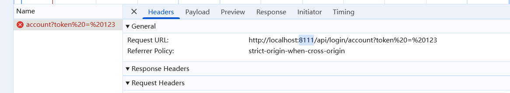

现在我退回，看看是否是哪个元素的原因，好像不是哪个元素的原因，服了，不知道什么原因

修改我注册的请求，改为我们自己的，注意参数，返回值code date,msg.

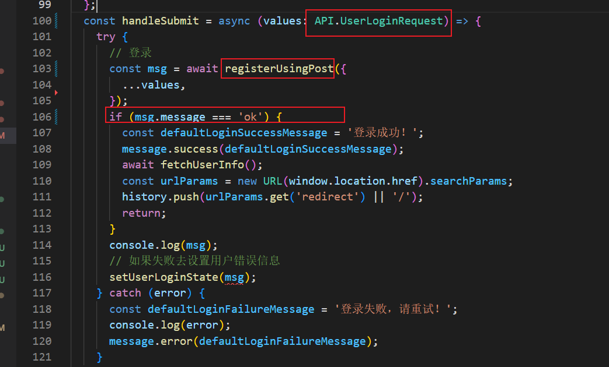

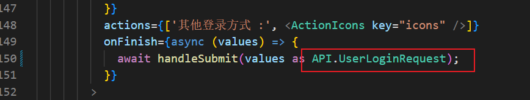

测试，确实是请求我们的地址了，但是后面有？token?xxxxxx

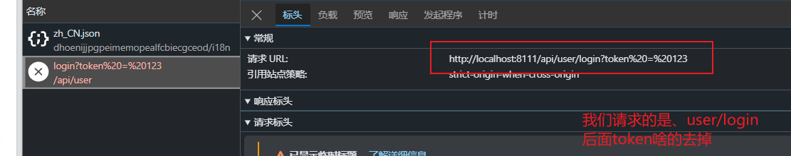

直接删了

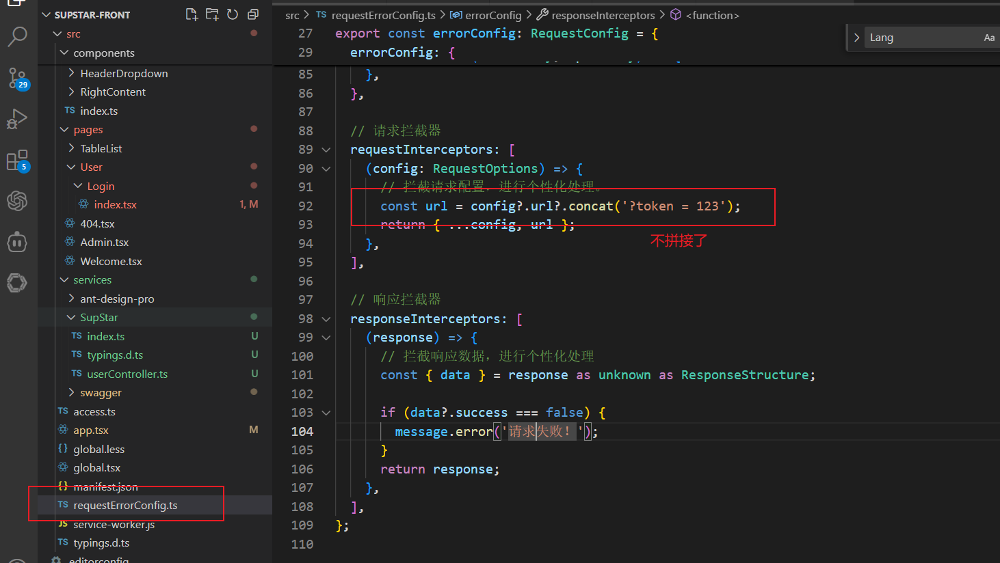

修改后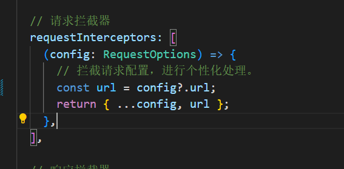

测试一下

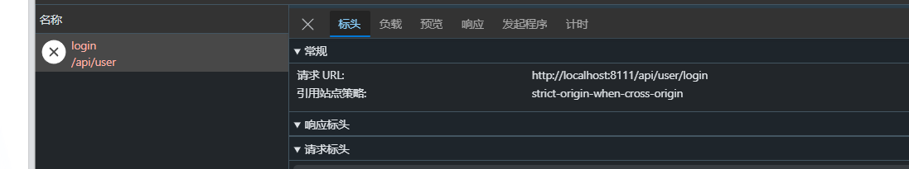

总算正确了。 现在还没有处理同源问题。

后端解决同源

```java

/**
 * 全局跨域配置
 * 该类用于配置Spring Boot应用的全局跨域资源共享（CORS）策略。
 * 通过实现WebMvcConfigurer接口并重写addCorsMappings方法，可以自定义CORS规则。
 */
@Configuration // 标记该类为配置类，Spring Boot会自动加载并应用该配置
public class CorsConfig implements WebMvcConfigurer {

    @Override
    public void addCorsMappings(CorsRegistry registry) {
        // 配置CORS规则
        registry.addMapping("/**") // 匹配所有路径，即对所有请求应用CORS规则
                // 允许跨域请求携带凭证信息（如Cookies、HTTP认证等）
                .allowCredentials(true)
                // 允许哪些域名访问资源。使用allowedOriginPatterns而不是allowedOrigins，
                // 因为allowedOrigins("*")与allowCredentials(true)冲突。
                // allowedOriginPatterns支持通配符，且可以与allowCredentials(true)一起使用。
                .allowedOriginPatterns("*")
                // 允许的HTTP方法，包括GET、POST、PUT、DELETE和OPTIONS
                .allowedMethods("GET", "POST", "PUT", "DELETE", "OPTIONS")
                // 允许所有请求头
                .allowedHeaders("*")
                // 暴露所有响应头，使客户端可以访问这些头信息
                .exposedHeaders("*");
    }
}
```

测试通过

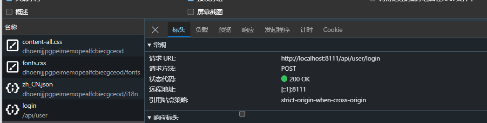

改造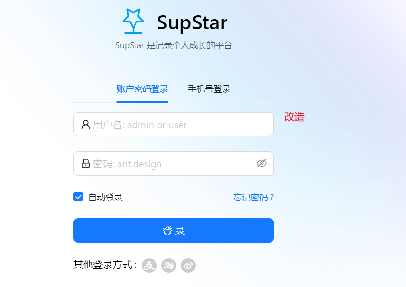

不要手机号登录，不要忘记密码，不要其他方式登录。

删除就行。

将忘记密码改为去注册。

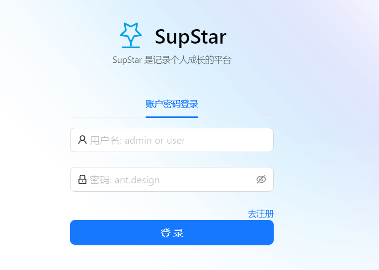

有没测试：FK

发测发现参数错误，原因是表单参数名和后端接口名称不一致

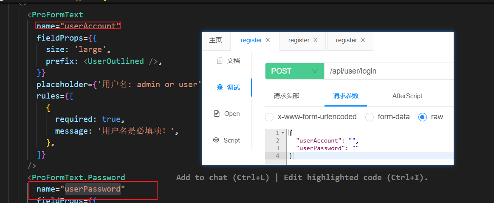

修改

测试

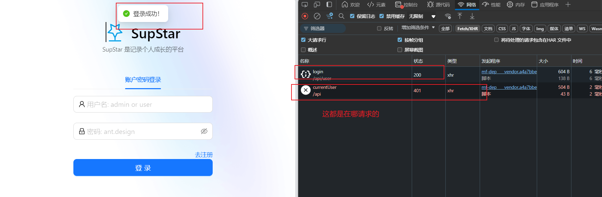

发现

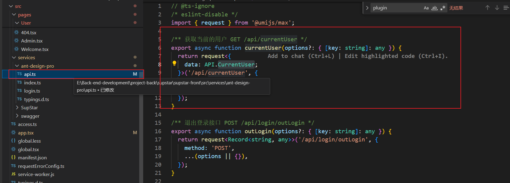

那我们不请求，不行，会报错

那就后端首先获取登录的接口

```java
  /**
     * 获取登录用户
     * @param request
     * @return
     */
    @GetMapping("/get/login")
    public BaseResponse<LoginUserVo> getLoginUserVo(HttpServletRequest request) {

        LoginUserVo loginUserVo = userService.getLogin(request);
        return ResultUtils.success(loginUserVo);

    }
```

```java
 /**
     * 获取当前登录用户
     * @param request
     * @return
     */
    @Override
    public LoginUserVo getLogin(HttpServletRequest request) {
        // 获取session
        Object user = request.getSession().getAttribute("user");
        if (user == null) {
        throw new BusinessException(ErrorCode.NOT_LOGIN_ERROR, "未登录");
        }
        // 根据id查询用户
        Long userId = (Long) user;
        User user1 = this.getById(userId);
        // 返回结果
        LoginUserVo loginUserVo = new LoginUserVo();
        BeanUtils.copyProperties(user1, loginUserVo);
        return loginUserVo;

    }
```

前端使用openapi，生成axios，替换掉上述的请求，注意响应的参数

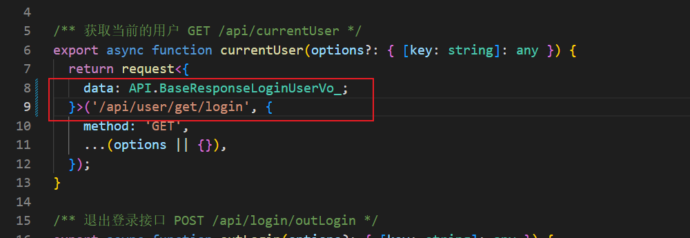


## 注册页面

仿照登录页面写

定义路由

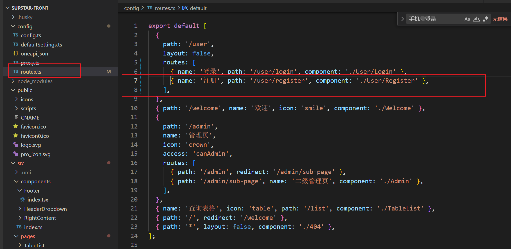


发现跳转不了，已解决，因为后端没有获取当前登录用户的接口，不过不符合逻辑，之后在考虑吧

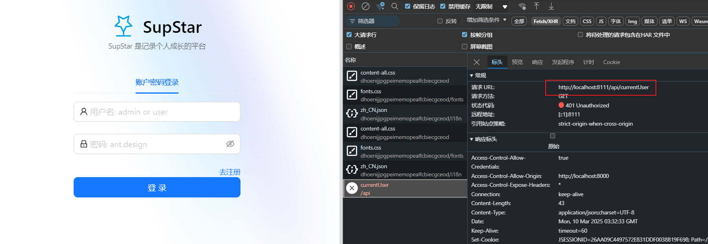

为啥会有这个请求

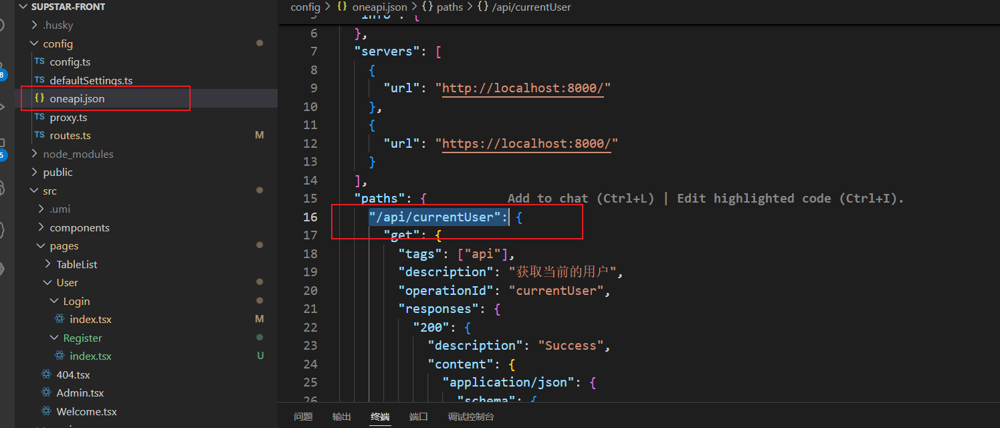

openapi.json,有什么用，我直接删了

还是错，删除缓存？

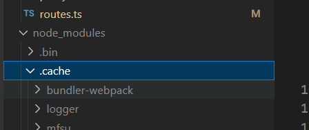

删不掉

我服了,先就这样吧

写页面和组件

上面的问题，已经解决，后端写过获取当前登录用户的接口。正常跳转后

修改注册页面，主要修改参数表单参数名称，axios请求，以及请求参数。

实现成功


登录有bug，登录后应该跳转到主页，但是不跳转，逻辑也写了跳转

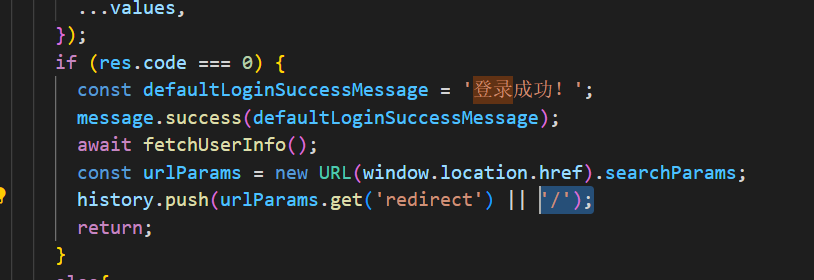

那就看路由。没问题

FK,原因是前端没有携带session。mad

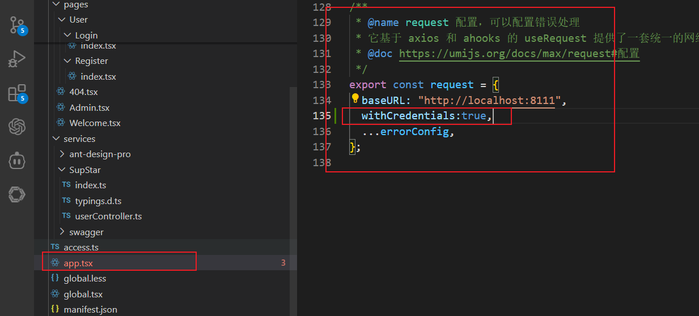

卧槽，搞了一个小时，后端debug了好多次，就是正确设置了session,但是根据session即使获得不了用户，想到了前端没带session,该了前端，携带session.还是不行，就像跨域的问题，但是跨域也允许携带session了。

最后发现前端该了带seesion,然后没保存，FK》


# fixbug

knife4j 显示不正确，我的接口明明是不一样的，但是显示的名称是一样的。

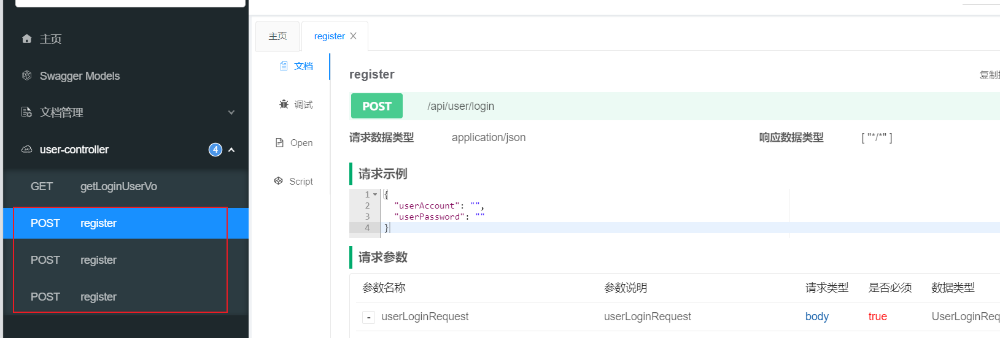

复现： 当时在写接口的时候，为了方便都直接复制，粘贴，该方法，但是没有该接口的名称，导致启动报错，然后才修改接口名称，但是之后就出现这样了。

一开始我不清楚为什么会出现这样的bug,现在（大概过了半天），突然想到可能是上述的原因。

解决版本：（尝试一下可不可以解决），移除knife4j 依赖和配置,然后重新引入。发现不行。在尝试删除tagert,重新打包，还是解决不了，取提问issue吧


